# 시뮬레이터 Code
## Video
---
1. 맵 주행

 

2. 차선 인식
3. 주차 미션

 

## Goal
---
### 1. 뱀 모양 맵을 벽에 부딪히지 않고 총 3바퀴 주행
### 2. 동영상에서 차선을 인식해서 핸들 이미지 조작
### 3. ar태그를 인식하여 주차 공간에 알맞게 주차

## Environment & Installation
---
- Ubuntu 18.04
- ROS Melodic
- ar-track-alvar v0.7.1
~~~bash
$ sudo apt update
$ sudo apt-get install ros-melodic-ar-track-alvar
~~~
- pygame v1.9.6
~~~bash
$ sudo apt update
$ sudo apt-get install python-pip
$ pip2 install pygame==1.9.6
~~~
- pillow v6.2.2 
~~~bash
$ pip2 install pillow==6.2.2
~~~

## Structure
---
~~~
src
  └─ ar_viewer
  │    └─ launch
  │    │    └─ ar_drive.launch
  │    │    └─ ar_parking_approach1.launch
  │    │    └─ ar_parking_approach2.launch
  │    │    └─ ar_parking_approach3.launch
  │    │    └─ ar_parking_tryout.launch
  │    └─ src
  │    │    └─ ar_drive.py
  │    │    └─ ar_parking_approach1.py
  │    │    └─ ar_parking_approach2.py
  │    │    └─ ar_parking_approach3.py
  │    │    └─ ar_parking_tryout.py
  └─ line_drive
  │    └─ src
  │    │    └─ kmu_track.mkv
  │    │    └─ line_drive.py
  │    │    └─ steer_arrow.png
  └─ xycar_sim_drive
  │    └─ launch
  │    │    └─ xycar_sim_drive_approach1.launch
  │    │    └─ xycar_sim_drive_tryout.launch
  │    │    └─ xycar_sim_drive_tryout_obstacle.launch
  │    └─ maps
  │    │    └─ ㄹ.so
  │    │    └─ ㄹ_obstacle.so
  │    │    └─ ㅁ.so
  │    │    └─ 凹.so
  │    └─ src
  │    │    └─ main.py
  │    │    └─ ultra_driver_approach1.py
  │    │    └─ ultra_driver_tryout.py
  │    │    └─ ultra_driver_obstacle.py
  └─ xycar_sim_parking
       └─ src
            └─ main.py
~~~

## Usage
---
### 1. 맵 주행
- 알고리즘 기반 주행1
~~~bash
$ roslaunch xycar_sim_drive xycar_sim_drive_approach1.launch
~~~
- 알고리즘 기반 주행2
~~~bash
$ roslaunch xycar_sim_drive xycar_sim_drive_tryout.launch
~~~
- 알고리즘 기반 주행3(ㄹ_obstacle 맵 주행 가능)
~~~ bash
$ roslaunch xycar_sim_drive xycar_sim_drive_obstacle.launch
~~~
- map 바꾸는 방법
~~~ bash
$ src/xycar_sim_drive/maps 안에 있는 맵들을 src/xycar_sim_drive/src 폴더에 map.so로 바꿔서 넣고 실행.
~~~
### 2. 차선 인식
- track1 주행
~~~bash
$ cd src/line_drive/src
$ python line_drive1.py
~~~
- track2 주행
~~~bash
$ cd src/line_drive/src
$ python line_drive2.py
~~~
### 3. 주차 미션
- 알고리즘 기반 artag 거리 정보와 yaw 값 이용한 버전1
~~~bash
$ roslaunch ar_viewer ar_parking_approach1.launch
~~~
- 알고리즘 기반 artag 거리 정보와 yaw 값 이용한 버전2
~~~bash
$ roslaunch ar_viewer ar_parking_approach2.launch
~~~
- 알고리즘 기반 artag 거리 정보와 yaw 값 이용한 버전3
~~~bash
$ roslaunch ar_viewer ar_parking_tryout.launch
~~~
- 알고리즘 기반 DX값과 DY값을 arctan계산하여 angle값 구한 버전
~~~bash
$ roslaunch ar_viewer ar_parking_approach3.launch
~~~

## Procedure & Try
---
### 1. 맵 주행
- 초음파 거리 센서 값 측정
  - 초음파 센서 거리 값을 측정하여 차량이 벽 또는 장애물을 회피하기 위한 적절한 거리값을 알아냄.
- 회피 주행
  - 위에서 알아낸 거리값을 이용하여 벽 또는 장애물을 회피하는 주행 구현 
- xycar_sim_drive_approach1
  - 알고리즘 기반 주행1 - 초음파 센서의 왼쪽, 오른쪽값을 비교해서 거리가 긴 쪽으로 조향.
- xycar_sim_drive_tryout
  - 알고리즘 기반 주행2 - 초음파 센서의 왼쪽, 오른쪽값을 측정해 (왼쪽 < 240, 오른쪽 > 120 이면 우회전), (왼쪽 > 120 이면 좌회전), 모두 아니면 직진하도록 구현.
- xycar_sim_drive_obstacle
  - 알고리즘 기반 주행3 - 장애물을 피하기 위해 몇가지 조건을 추가. 초음파 센서의 왼쪽, 오른쪽값을 측정해 (왼쪽 < 240, 오른쪽 > 110 이면 우회전), (왼쪽 < 60, 오른쪽 < 110이면 우회전), (왼쪽 > 110이면 좌회전), 모두 아니면 직진하도록 구현.
### 2. 차선 인식
- 이미지 Calibration
  - 카메라로 촬영한 동영상 이미지는 왜곡 현상이 발생할 수 있기 때문에 calitation 과정을 통해서 왜곡 현상 제거
  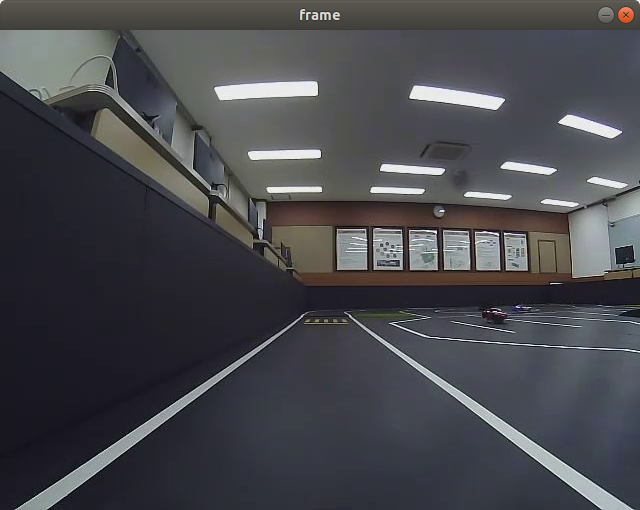{: width="320" height="240"}
  {: width="320" height="240"}

- ROI 영역을 설정하여 Bird's eye view 형태로 변경
  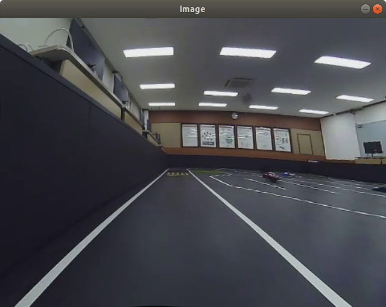{: width="320" height="240"}

- HLS 포맷에서 L 채널을 이용해서 흰색 검출 후, 이진화 처리
- histogram을 사용해서 좌우 차선의 시작 위치를 파악하기
  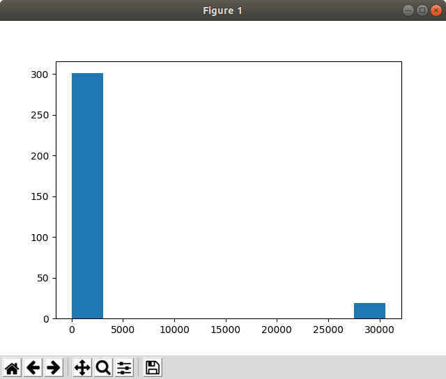{: width="320" height="240"}

- sliding window로 좌우 9개씩 쌓아 올리고 중심점(x좌표) 9개로 2차 함수 만들어내기(차선 영역 표시)
  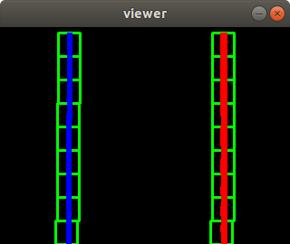{: width="320" height="240"}
  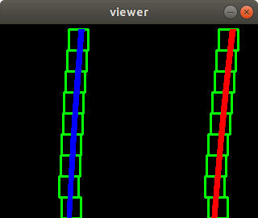{: width="320" height="240"}

- 2차 함수 중 특정 Offset(좌표)의 x 값으로 왼쪽 차선과 오른쪽 차선 정의 후, 핸들 조향
  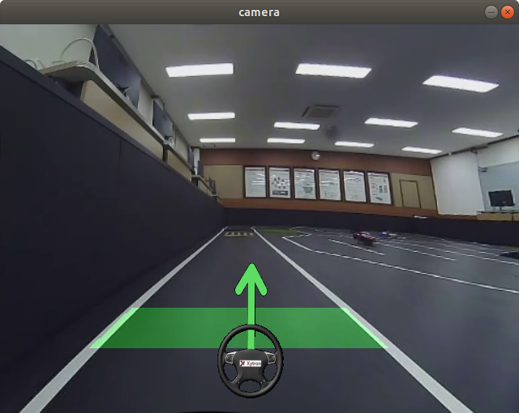{: width="320" height="240"}
  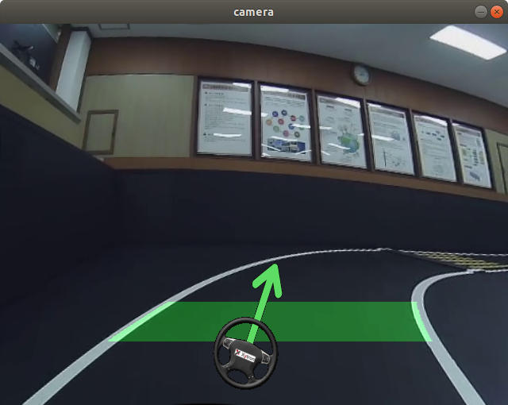{: width="320" height="240"}
### 3. 주차 미션
- ar 태그 까지의 거리 정보, 각도, yaw값 확인
  - ar_pose_marker 토픽을 이용해 차량과 ar태그 까지의 거리, 각도, yaw값 계산.
- 주차공간안에 똑바로 주차하기
  - ar_pose_marker 토픽의 자세정보(쿼터니언값)을 오일러 값으로 변환해 yaw값 계산. 똑바로 주차하기 위해 차량의 yaw값을 이용하여 후진하고 다시 주차하는 주행 구현.
- arctan를 이용하여 조향값 계산
  - approach1, approach2, tryout의 경우 하드 코딩의 느낌이 많이 들어, DX, DY값(ar태그 까지의 거리정보)을 이용하여 arctan로 각도를 구해서 조향값을 결정.

## Limitations
---
### 1. 맵 주행
- 좌회전과 우회전을 모두 할 수 있는 조건이 필요 했음.
- 하드 코딩 느낌이라 모든 맵을 수용할 수 있을지 의문. 
- 실제 차에서 구현할 때는 센서의 딜레이 때문에 알고리즘 수정 필요할 것으로 예상.
### 2. 차선 인식
- 'track 1'은 바닥이 어둡고 차선이 밝아서 차선 인식이 잘되었지만 'track 2'는 바닥에 조명이 반사된 빛 때문에 차선 인식 성능이 좋지 않음.
  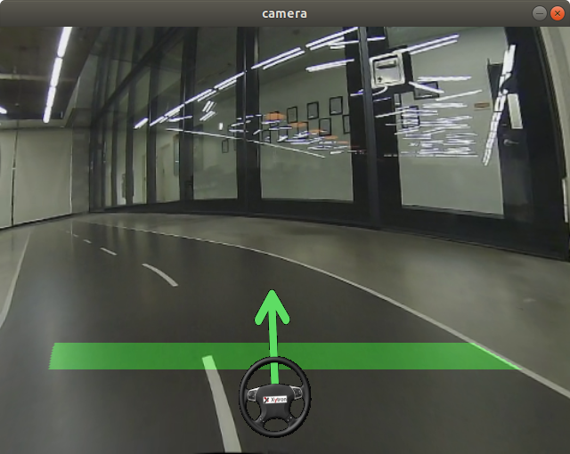{: width="320" height="240"}
  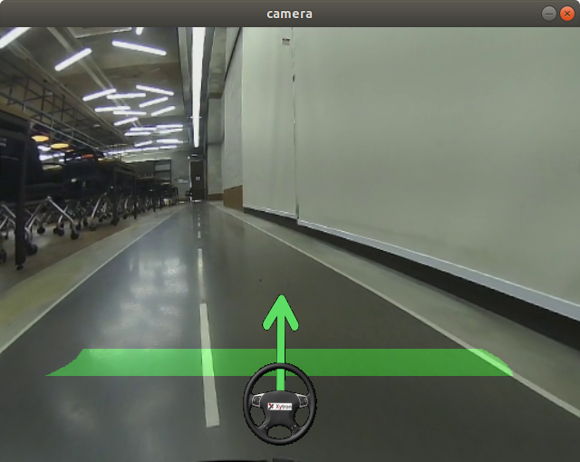{: width="320" height="240"}

- 'track 2' 에서 조명이 일정하지 않아서 영상의 밝기가 고르지 않음.(일정 ROI의 값으로 이진화 임계값을 매번 다르게 조절로 해결)
  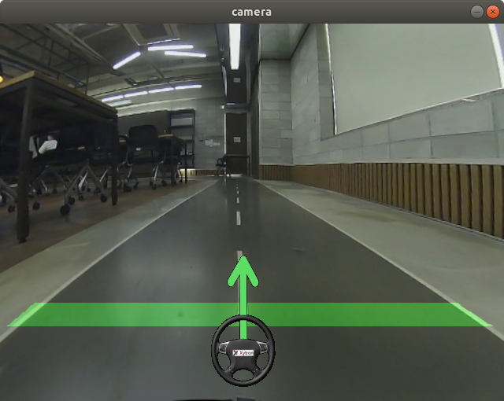{: width="320" height="240"}
  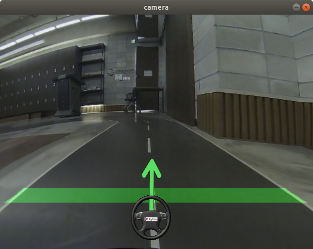{: width="320" height="240"}

- 'track 1'은 좌회전 or 우회전할 때 모든 차선이 보였지만 'track 2'는 좌회전 or 우회전할 때 한 쪽 차선이 보이지 않음
  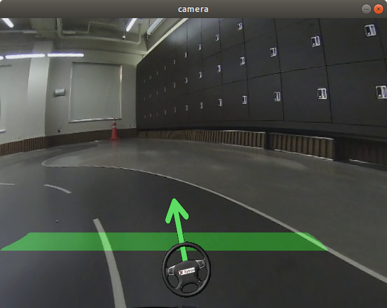{: width="320" height="240"}
  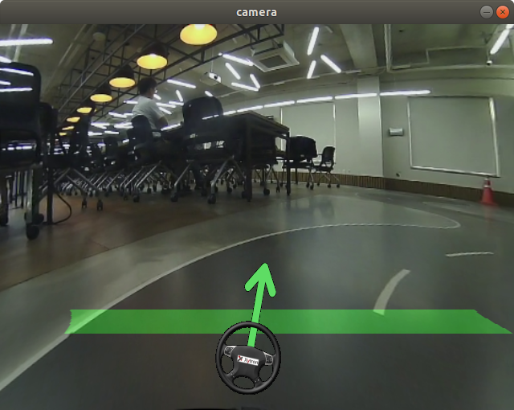{: width="320" height="240"}
### 3. 주차 미션
- yaw 개념이 추가되어 주차구역에 차량의 heading 방향을 완벽하게 맞추는 과정이 어려웠음.
- arctan로 angle 값을 구하는 과정에서 float devision by zero 에러가 발생하여 분모값인 DY의 초기값으로 1.0으로 설정.

## What I've learned
---
### 1. 맵 주행
- 최대한 많은 맵에서 주행이 가능한 알고리즘이 좋은 알고리즘이란 생각을 하게됨.
- 하드코딩식으로 알고리즘을 짜게 되면 한정된 맵에서만 주행이 가능하다는 사실을 배움.
### 2. 차선 인식
- 2개의 동영상에 대해 적용해보면서 이미지 처리에서는 카메라를 설치하는 위치와 조명에 큰 영향을 받는다는 것을 배움.
- Bird's eyes view image로 바꾸면서 원근 변환에 대해서 배움
### 3. 주차 미션
- 목표지점까지 갈 수 있는 angle값만 생각하는 것이 아닌 차량의 heading값도 조절하는 방법을 배움.
- 하드코딩 식이 아닌 좀 더 효율적인 알고리즘을 짜는 법을 배움.
